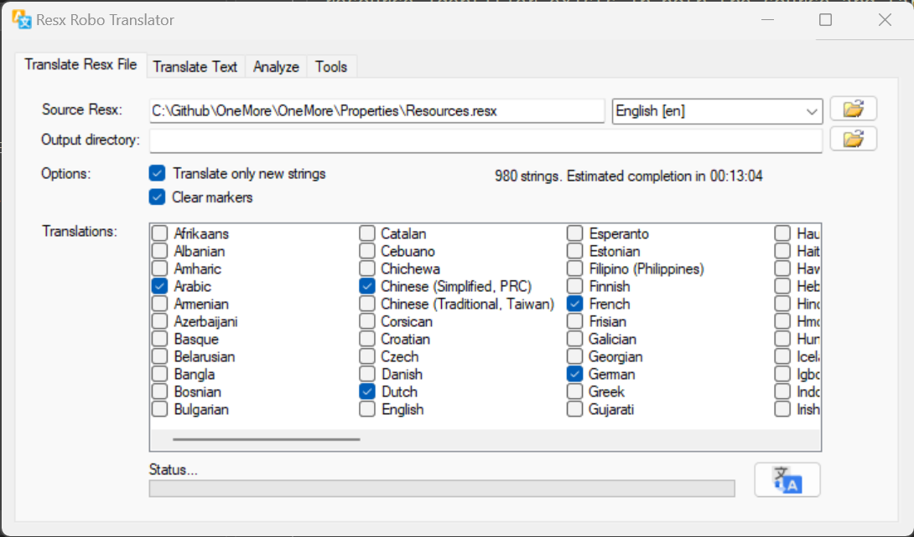
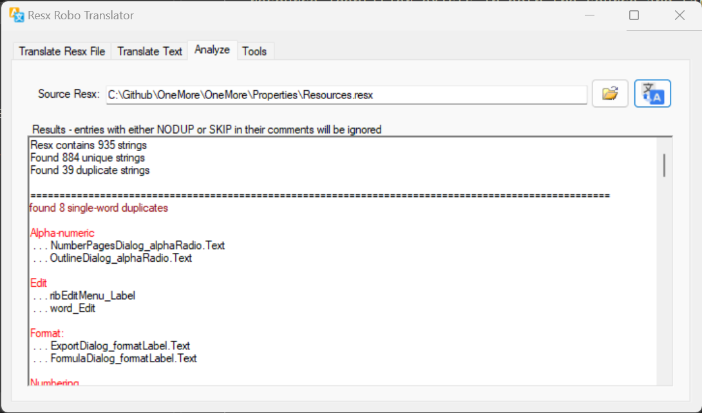
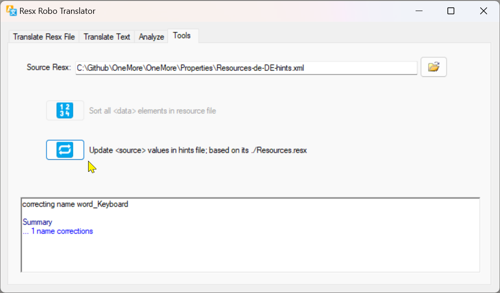

# ResxTranslator
Translates entire resx files or individual bits of text to multiple languages.

There are four main tabs

- Translate Resx file - translates a resx file to the specified languages, fully explained below.
- Translate Text - translates a given text to a selected language. Use this for quick translations
- Analyze - identifies duplicate words and phrases in the resx file, useful for consolidating and cleaning up resource strings
- Tools - Additional resx management tools

Inspired by https://github.com/salarcode/AutoResxTranslator

## Translate Resx File
Translates an entire .resx file to one or more languages.

1. Choose a .resx file to translate. It will detect the language based on the language/culture
   code in the filename, or English if no code is included. It will remember the last file
   translated.
2. Choose the output directory where new .resx files should be stored. If this is left blank
   then new files are stored in the same directory as the source file.
3. Choose the target translation languages. 

_Options_

* Enable the _Translate only new strings_ checkbox to translate only new strings that were added
  to the source resx file that are not yet in the target resx file(s). It will detect entries
  that were deleted in the source file and remove them from the target files. It also detects
  the keyword **EDIT** in the comment of each entry; if this keyword is found, it will translate
  that entry and replace the value in all taret files; if this keyword is not found and the
  resource identifier exists in both the source and target file, that entry is left untouched.

* Enable the _Clear markers_ checkbox to remove the EDIT keyword from all entires in the source
  resx file. If generating all languages in a single batch then you can safely enable this option.
  If translating one language at a time, enable this only when processing the last target file
  in your workflow, otherwise subsequent runs may not produce the correct results.

### Language Selections



### Working


### Skipping Resources

If the resource file includes control or configuration entries that should not be translated
then flag these by including the word **SKIP** in the entry's comment. It must be capitalized.
The comment can include other text besides the word SKIP.

### Using an Override Hint File

While Google translator is generally quite good, there are nuances in languages that it can't
predict and may make a native speaker question the appropriateness of the translation. For each
language, you can provide an optional hint file that contains preferred translations for each
resource identifier. This must be an XML file located in the same directory as the source resx
file and must be named _name_._code_-hints.xml, for example Resources.de-DE-hints.xml.

The contents of the hints file should look similar to the following:

```xml
<?xml version="1.0" encoding="utf-8"?>
<hints>
  <hint name="resouce-identifier1">
    <source>
      copy of the source text from the main resx file
    </source>
    <preferred>
      my preferred translation here
    </preferred>
  </hint>
  <hint name="resouce-identifier2">
    <source>
      copy of the source text from the main resx file
    </source>
    <preferred>
      my preferred translation here
    </preferred>
  </hint>
</hints>
```
When resources are translated to that language, ResxTranslator will first look in this hint file
each resource identifier and use the available text before attempting to use Google translate.

Notice that the file includes a copy of the original source text. ResxTranslator uses this to
detect if the source item has been updated since this hint was last created and display a warning
that the hint may be out of date and needs correcting.

## Translate Text
Translate one string, phrase, or paragraph of text.


### Inflation Detection

The free Google translator will sometime add extra spaces around non-alphanumeric characters
when translating. For example "x+1" may become "x + 1" (from no spaces around the plus sign,
to spaces around the plus sign.) 

ResxTranslator attempts to detect this string *inflation* and displays a warning for each
string that may need manual tuning. Of course, the program itself has no way of knowing the
exact context of the translation so it simply compares the number of spaces in the input
string and the output string. Most of the time, the translation is accurate and shouldn't
need to be adjusted manually.

## Analyze

The Analyze tab analyzes a resx file looking for duplicate uses of words and phrase.



### Ignoring Known Duplicate

There will likely be legitimate cases where you want to use duplicates but in very
different contexts. In these case, you can tag those resources with the NODUP keyword;
the analyzer will ignore those resources and not report them as duplicates.

## Tools

The Tools tab contains operations that help maintain resx files.



### Sort Data Items
Sorts the `<data>` items within a resx file alphabetically by resourceID.
This makes it easier to find specific resources when viewing the file in a text editor.

### Update Hint Sources
Updates the values of the `<source>` elements within an override hints file. 
This should be used when the original source text has changed so you can verify
individual items. It can also be used to fill in any missing `<source>` elements or values
or correct the case-sensitive resource name of each hint.
